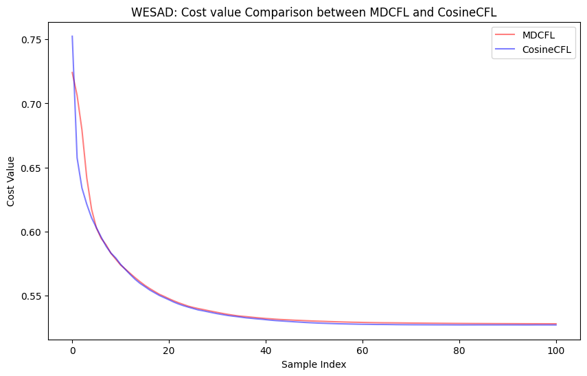
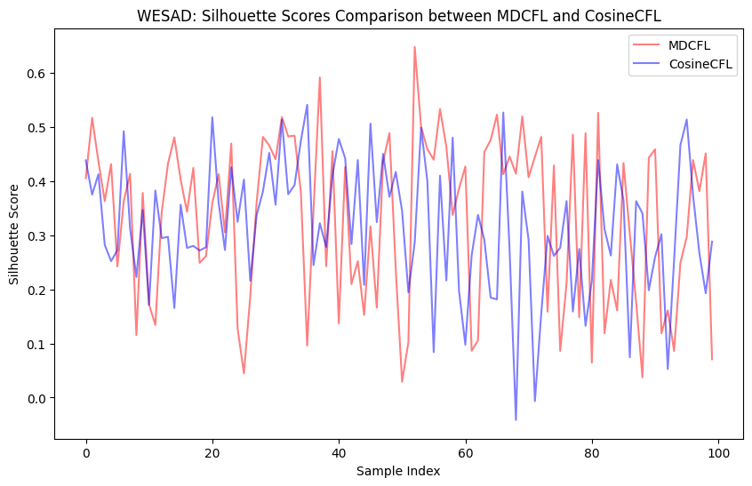
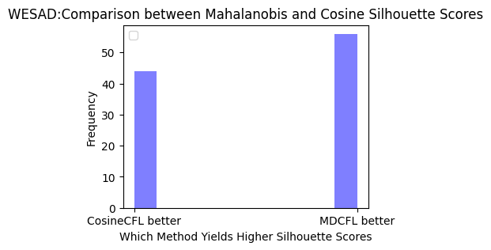

## Clustered Federated Learning Based on Mahalanobis Distance for Sequential Medical Data
____

### Abstract
In hospitals, metadata typically contains patient personal information based on the doctor's diagnosis.
Therefore, sniffers or hijackers could launch attacks to steal important information from hospitals or patients.
For this reason, hospital data must be anonymized and protected by specialized systems to ensure its safe use,
especially when multiple hospitals share data. If hospitals implement systems that can securely share data while
maintaining privacy, researchers and clinicians can leverage large amounts of distributed data to more
effectively train deep learning models. In this context, we select a solution based on Clustered Federated
Learning (CFL). In typical CFL scenarios, forming appropriate clusters can help build more personalized
models for different groups. However, previous CFL approaches still face challenges from model
heterogeneity. To further mitigate the heterogeneity problem, we propose a Mahalanobis Distance based
Clustered Federated Learning (MD-CFL) method, which offers advantages in reducing model heterogeneity
and improving clustering performance by correcting for feature skew in non-normalized data. Our experiments
show that MD-CFL achieves accurate clustering performance, with a higher Silhouette score compared to
cosine-based FedAvg.

[Paper_Link: https://doi.org/10.3745/JIPS.03.0211](https://doi.org/10.3745/JIPS.03.0211) 

### Result

